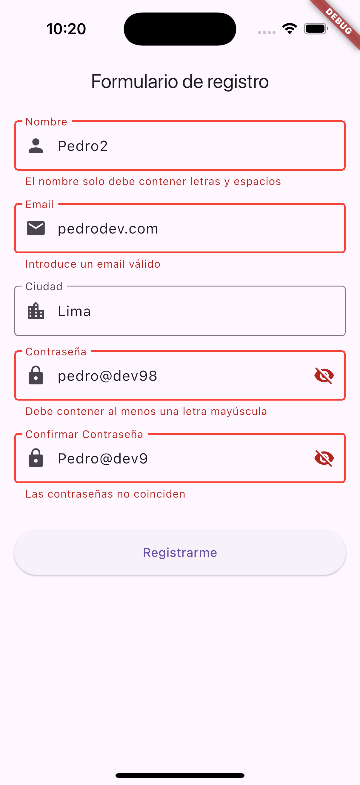
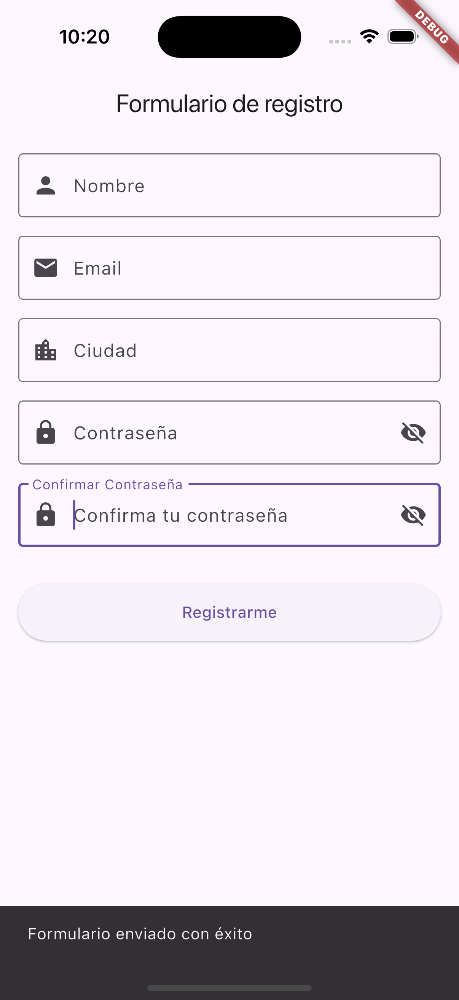

# Flutter Form Validation


## Descripción

Este proyecto es un ejemplo de una aplicación Flutter que implementa un formulario con validaciones avanzadas utilizando el paquete [Formz](https://pub.dev/packages/formz). La aplicación demuestra cómo gestionar estados de formularios, realizar validaciones en tiempo real y proporcionar una experiencia de usuario fluida y responsiva.


## Capturas de Pantalla


*Formulario sin errores visibles al inicio.*


*Mensajes de error aparecen al interactuar con los campos.*


*Mensaje de éxito tras enviar el formulario correctamente.*

## Requisitos

- **Flutter SDK:** ≥ 3.27.2
- **Dart SDK:** ≥ 3.6.1
- **Sistema Operativo:** Windows, macOS, Linux, o dispositivos móviles (iOS/Android)
- **Editor de Código:** [Visual Studio Code](https://code.visualstudio.com/) o [Android Studio](https://developer.android.com/studio)

## Instalación

### 1. Clonar el Repositorio

Abre tu terminal o línea de comandos y ejecuta:

```bash
git clone git@github.com:pdroariasvilela/form_app.git
```

### 2. Navegar al Directorio del Proyecto
```bash
cd form_app
```

### 3. Instalar Dependencias
```bash
flutter pub get
```
### 4. Verificar la Configuración
```bash
flutter doctor
```
Resuelve cualquier problema que aparezca antes de continuar.

### USO

### 1. Ejecutar la Aplicación en un Emulador o Dispositivo

Asegúrate de tener un emulador en ejecución o un dispositivo físico conectado. Luego, ejecuta:

```bash
flutter run
```

### 2. Interactuar con el Formulario
```bash
	•	Email: Introduce un correo electrónico válido.
	•	Ciudad: Introduce tu ciudad (campo obligatorio).
	•	Contraseña: Introduce una contraseña que cumpla con los criterios de seguridad.
	•	Confirmar Contraseña: Repite la contraseña ingresada anteriormente.
```
Los mensajes de error aparecerán en tiempo real a medida que interactúas con los campos.

### Licencia

Este proyecto está licenciado bajo la Licencia MIT. Consulta el archivo LICENSE para más detalles.